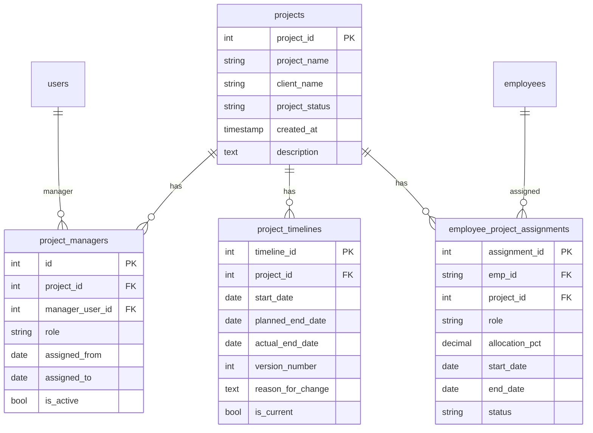

# Project Component — Database Design Plan

## Alignment with existing codebase

Your existing schema uses:

- **PKs:** `Integer` for most entities (`user_id`, `assignment_id`, `req_id`, etc.); `String(20)` only for `employees.emp_id`.
- **FKs:** Explicit references, e.g. `ForeignKey("users.user_id")`, `ForeignKey("employees.emp_id")`; often `ondelete="RESTRICT"` or `CASCADE` where appropriate.
- **Timestamps:** `TIMESTAMP` with `server_default=func.now()` (e.g. [audit_log.py](backend/db/models/audit_log.py), [candidate.py](backend/db/models/candidate.py)).
- **Tables:** Snake_case, plural (`requisition_items`, `employee_assignments`). Models live under [backend/db/models/](backend/db/models/) and are exported from [backend/db/models/**init**.py](backend/db/models/__init__.py).
- **Migrations:** Alembic; one migration per feature; `op.create_table` + indexes + CheckConstraints where used (e.g. [add_candidates_interviews.py](backend/alembic/versions/add_candidates_interviews.py)).

The design below follows these conventions and adds only the four tables you specified. Linking **requisitions** to projects (e.g. `requisitions.project_id`) is left as an optional future step.

---

## 1. Table: `projects`

Core identity; no FKs to managers or dates.

| Column         | Type        | Nullable | Notes                       |
| -------------- | ----------- | -------- | --------------------------- |
| project_id     | Integer     | No       | PK, auto-increment          |
| project_name   | String(200) | No       |                             |
| client_name    | String(200) | Yes      |                             |
| project_status | String(30)  | No       | See status constraint below |
| description    | Text        | Yes      |                             |
| created_at     | TIMESTAMP   | No       | server_default=func.now()   |

**Constraint:** `project_status` — suggest `CheckConstraint` with values: `'Active'`, `'On Hold'`, `'Completed'`, `'Cancelled'` (or extend as needed). Use a single canonical set so UI and APIs stay consistent.

**Indexes:** `ix_projects_status`, optionally `ix_projects_client_name` if you filter by client.

---

## 2. Table: `project_managers`

Many-to-many between projects and users (managers); supports role and tenure.

| Column          | Type       | Nullable | Notes                                                                                        |
| --------------- | ---------- | -------- | -------------------------------------------------------------------------------------------- |
| id              | Integer    | No       | PK                                                                                           |
| project_id      | Integer    | No       | FK → projects(project_id), ondelete CASCADE                                                  |
| manager_user_id | Integer    | No       | FK → users(user_id), ondelete CASCADE or RESTRICT                                            |
| role            | String(50) | No       | e.g. Lead PM, Delivery Head, Tech Lead, Program Manager, Delivery Manager, Technical Manager |
| assigned_from   | Date       | No       | When this assignment started                                                                 |
| assigned_to     | Date       | Yes      | When it ended (NULL = still active)                                                          |
| is_active       | Boolean    | No       | server_default true; true when assigned_to IS NULL and not manually deactivated              |

**Indexes:**

- `ix_project_managers_project_id`
- `ix_project_managers_manager_user_id`
- Optional: composite `(project_id, is_active)` for “current managers per project” queries.

**Note:** If you want a strict “one current timeline per project” style for managers, you can add a partial unique index later; for now, `is_active` + `assigned_to` is enough for querying.

---

## 3. Table: `project_timelines`

Flexible, versioned deadlines; no start/end on `projects`.

| Column            | Type    | Nullable | Notes                                                        |
| ----------------- | ------- | -------- | ------------------------------------------------------------ |
| timeline_id       | Integer | No       | PK                                                           |
| project_id        | Integer | No       | FK → projects(project_id), ondelete CASCADE                  |
| start_date        | Date    | No       |                                                              |
| planned_end_date  | Date    | No       |                                                              |
| actual_end_date   | Date    | Yes      |                                                              |
| version_number    | Integer | No       | server_default 1; increment on each change                   |
| reason_for_change | Text    | Yes      |                                                              |
| is_current        | Boolean | No       | server_default true; only one row per project should be true |

**Indexes:**

- `ix_project_timelines_project_id`
- **Partial unique index:** `(project_id) WHERE is_current = true` so at most one current timeline per project. Implement in migration with `op.create_index(..., postgresql_where=sa.text('is_current = true'))` (or equivalent for your DB). If you use MySQL, use a different approach (e.g. trigger or app-level enforcement).

---

## 4. Table: `employee_project_assignments`

Resource allocation to projects (distinct from existing [employee_assignments](backend/db/models/employee_assignment.py) which is department/manager/location).

| Column         | Type         | Nullable | Notes                                                |
| -------------- | ------------ | -------- | ---------------------------------------------------- |
| assignment_id  | Integer      | No       | PK                                                   |
| emp_id         | String(20)   | No       | FK → employees(emp_id), ondelete CASCADE or RESTRICT |
| project_id     | Integer      | No       | FK → projects(project_id), ondelete CASCADE          |
| role           | String(100)  | Yes      | Role on this project                                 |
| allocation_pct | Numeric(5,2) | No       | 0–100; CheckConstraint                               |
| start_date     | Date         | No       |                                                      |
| end_date       | Date         | Yes      | NULL = ongoing                                       |
| status         | String(20)   | No       | e.g. Active, Ended, Planned; CheckConstraint         |

**Constraints:**

- `allocation_pct` between 0 and 100.
- `status` in (`'Planned'`, `'Active'`, `'Ended'`) (or your chosen set).

**Indexes:**

- `ix_employee_project_assignments_emp_id`
- `ix_employee_project_assignments_project_id`
- Optional: composite `(emp_id, project_id)` for overlap/validation queries (e.g. sum of allocation_pct per emp per date range).

---

## 5. Audit log (no new tables)

Use the existing [audit_log](backend/db/models/audit_log.py) table. No schema change is required; the plan is to **log all write operations** on the four Project entities so they appear in the Admin Audit Log viewer and in exports.

**Entity names and when to log**

| Entity              | entity_name (use in AuditLog) | entity_id           | Log on                 |
| ------------------- | ----------------------------- | ------------------- | ---------------------- |
| Project             | `Project`                     | project_id (str)    | CREATE, UPDATE, DELETE |
| Project manager     | `ProjectManager`              | id (str)            | CREATE, UPDATE, DELETE |
| Project timeline    | `ProjectTimeline`             | timeline_id (str)   | CREATE, UPDATE, DELETE |
| Employee assignment | `EmployeeProjectAssignment`   | assignment_id (str) | CREATE, UPDATE, DELETE |

**What to store**

- **action:** `CREATE`, `UPDATE`, `DELETE` (same as existing convention in [skills.py](backend/api/skills.py), [candidates.py](backend/api/candidates.py)).
- **performed_by:** Current user’s `user_id` (from JWT/dependency).
- **old_value / new_value:** Optional JSON snippet or summary of changed fields for UPDATE; for DELETE, old_value can hold a snapshot. Keeps payload small; full history lives in the tables if needed.
- **target_user_id:** Leave null unless the action is about a user (e.g. assigning a manager); optional for Project entities.

**Implementation**

- In each Project API that creates/updates/deletes a row: after a successful commit, insert one [AuditLog](backend/db/models/audit_log.py) row (same pattern as [api/skills.py](backend/api/skills.py), [api/requisitions.py](backend/api/requisitions.py)).
- Reuse the existing audit log list/export APIs; they filter by `entity_name` and already exclude read-only actions. Add `Project`, `ProjectManager`, `ProjectTimeline`, `EmployeeProjectAssignment` to any Admin/HR entity filter list in the frontend so users can filter by these types.

---

## 6. Entity relationship (high level)

---

## 7. Implementation checklist (for when you implement)

1. **Models** — Add four new files under [backend/db/models/](backend/db/models/): `project.py`, `project_manager.py`, `project_timeline.py`, `employee_project_assignment.py` (or group in one `project.py` with multiple classes). Export them in [backend/db/models/**init**.py](backend/db/models/__init__.py).
2. **Alembic** — One migration (e.g. `add_projects_tables.py`) that creates the four tables in dependency order: `projects` first, then `project_managers`, `project_timelines`, `employee_project_assignments`; add FKs, indexes, and CheckConstraints; add partial unique index for `project_timelines(is_current)` if using PostgreSQL.
3. **Audit log** — In every Project API that performs a create/update/delete:

- Insert an [AuditLog](backend/db/models/audit_log.py) row with the appropriate `entity_name` (`Project`, `ProjectManager`, `ProjectTimeline`, `EmployeeProjectAssignment`), `entity_id` as the record’s PK (string), `action` = `CREATE` / `UPDATE` / `DELETE`, and `performed_by` = current user; optionally set `old_value`/`new_value` for UPDATE/DELETE.
- Reuse existing list/export endpoints; add the four entity names to any Admin Audit Log viewer filter list in the frontend so users can filter by Project-related actions.

1. **Optional later:** Add `requisitions.project_id` FK to link requisitions to a project; backfill from existing `project_name`/`client_name` if desired.

---

## 7. Design decisions summary

| Topic                  | Choice                                   | Reason                                                                      |
| ---------------------- | ---------------------------------------- | --------------------------------------------------------------------------- |
| project_id / PKs       | Integer, auto-increment                  | Matches users, requisitions, candidates, etc.                               |
| Manager reference      | users.user_id                            | Managers are users; consistent with raised_by, assigned_ta in requisitions. |
| Employee reference     | employees.emp_id                         | Matches employee_assignments, employee_skills, etc.                         |
| created_at             | Only on projects                         | Matches “project exists independently of dates”; timelines hold dates.      |
| is_current (timelines) | One per project via partial unique index | Ensures a single “current” timeline per project.                            |
| allocation_pct         | Numeric(5,2), 0–100                      | Allows decimals; CheckConstraint enforces range.                            |
| Audit log              | Use existing audit_log; no new tables    | Log CREATE/UPDATE/DELETE for all four entity types; filter in Admin viewer. |

This keeps the Project component consistent with your current DB style and leaves room to link requisitions to projects later without changing the core project design.
