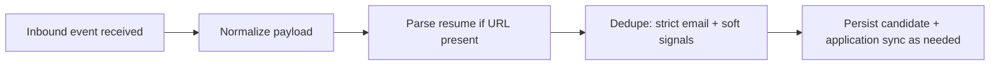
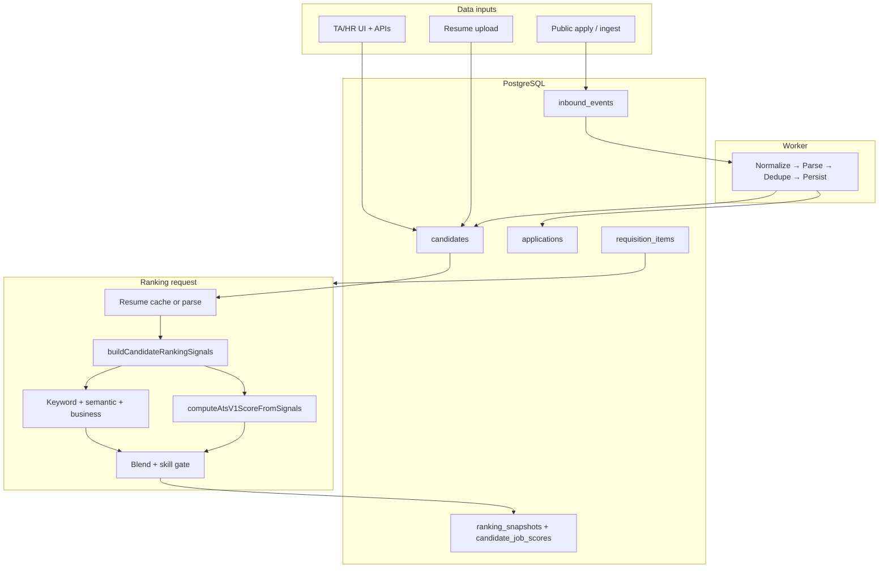

# ATS system overview — data flow and processing

This document describes how the Applicant Tracking System (ATS) works in **rms-next**: where data comes from, how it is stored, and how ranking and scoring run. It reflects the code as implemented (Next.js App Router, PostgreSQL, Drizzle ORM).

For phase history and schema deltas, see [ATS_IMPLEMENTATION_CONTEXT.md](./ATS_IMPLEMENTATION_CONTEXT.md). Product rule details for ATS V1 live under the repo’s `docs/ATS` materials where referenced in code.

---

## 1. High-level architecture

| Layer | Role |
|--------|------|
| **UI + HTTP API** | Next.js `src/app` — pages and `src/app/api/**` route handlers |
| **Business logic** | `src/lib/services/*` — auth, ingest, candidates, applications, ranking, resume parsing |
| **Data access** | `src/lib/repositories/*` + `src/lib/db/schema.ts` (Drizzle) |
| **Async ingest** | BullMQ + Redis — worker `src/lib/queue/workers/process-event-worker.ts` processes inbound events |
| **Storage** | PostgreSQL; resume/JD files on local disk paths (or URLs) per env |

Multi-tenancy: most ATS rows carry **`organization_id`**. API users resolve an active organization from JWT (`org_id`) and membership (`organization_members`).

---

## 2. Where candidate data comes from

### 2.1 Internal users (TA / HR / Admin)

- **Candidates** are created or updated through authenticated APIs (`/api/candidates`, related routes).
- **Resumes** are often uploaded via **`POST /api/uploads/resume`**, which stores the file and returns a **`file_url`** (path) saved on the `candidates.resume_path` field (or equivalent flow from the UI).

### 2.2 Public apply (no staff session)

- **`POST /api/public/apply/[slug]`** accepts an application payload (validated), rate-limited.
- It does **not** write candidates directly. It appends an **`inbound_events`** row and returns **202** with an acknowledgment.
- Processing continues **asynchronously** when the inbound worker runs (see §3).

### 2.3 Ingest integrations

- Additional sources (e.g. Naukri, LinkedIn, bulk ingest) follow the same pattern: accept payload → **`inbound_events`** ledger → worker pipeline.
- Dedupe and persistence rules live in `inbound-events-processing-service.ts`.

### 2.4 Core relational objects

- **`requisitions`**: hiring request header (org-scoped).
- **`requisition_items`**: one line per role/opening; holds JD text, requirements, pipeline JD overrides, **`ranking_required_skills`**, budgets, status, assigned TA, etc.
- **`candidates`**: person attached to a **requisition item** (and parent requisition); stores contact info, **`resume_path`**, **`candidate_skills`**, **`total_experience_years`**, **`notice_period_days`**, **`education_raw`**, stage, org, etc.
- **`applications`**: one application per candidate for that pipeline (stage moves and history are tracked for the application where implemented).

---

## 3. Inbound event pipeline (queue-driven)

When an **`inbound_events`** row is processed, the worker runs a **chain of jobs**:

1. **Normalize** — builds a **`NormalizedInboundCandidate`** (name, email, phone, resume URL, job slug, source, external id).
2. **Parse resume** — calls **`parseResumeArtifact`** (see §4); writes a row to **`resume_parse_artifacts`** for audit.
3. **Deduplicate** — email-first; optional soft match (phone / name / company) with review hints.
4. **Persist** — creates or updates **`candidates`** (and related records); may merge parser-derived skills and structured fields into the row per service logic.

Until persistence completes, the candidate may not appear on TA boards; ranking only includes candidates already stored for that **requisition item**.

---

## 4. Resume parsing

**Service:** `src/lib/services/resume-parser-service.ts`

- **Inputs:** path or `http(s)` URL to **`.pdf`** or **`.docx`** (local parser).
- **Behavior:** extract plain text; run lightweight heuristics for emails, phones, a small **known skill list**, years of experience, notice period, education snippet.
- **Output:** **`ParsedResumeArtifact`**: `status` (`processed` | `failed` | `skipped`), `rawText`, `parsedData` (structured bag), `errorMessage`, provider/version labels.

**Used in two places:**

1. **Inbound pipeline** — persisted to **`resume_parse_artifacts`** (audit by `inbound_event_id`) and to **`candidates.resume_parse_cache`** + **`candidates.resume_content_hash`** when a candidate row is written.
2. **Ranking** — prefers **`resume_parse_cache`** when **`resume_path`** matches and (for local files) file `size`/`mtime` match the cached stat; otherwise calls **`parseResumeArtifact`** and batch-updates the candidate cache. This avoids double-parsing stable resumes.

**Resume deduplication:** same org + requisition item + content hash can set **`duplicate_resume_of_candidate_id`** (different email). Optional strict mode **`CANDIDATE_RESUME_HASH_REJECT_DUPLICATES`** returns **409** on create instead of flagging.

### 4.1 Structured resume profile (production path)

**Columns:** `candidates.resume_structured_profile` (versioned JSON) and optional **`resume_structure_status`** (`ready` | `pending` | `failed`).

**Code:** `src/lib/services/resume-structure/` — Zod schema (**`resume-structure.schema.ts`**, `schema_version: 1`), deterministic **`rules-extractor-v2.ts`**, optional **`llm-refiner.ts`** (OpenAI-compatible HTTP), orchestration **`resume-structure-pipeline.ts`**, merge **`merge-candidate-profile.ts`**.

**When it runs**

- **Inbound persist** and **manual candidate create** (when a resume is parsed): if **`RESUME_STRUCTURE_ENABLED=true`**, rules v2 runs on resume plain text; validated JSON is stored. Low-confidence runs can **enqueue** async LLM refinement (`resume-structure` queue) when **`RESUME_STRUCTURE_LLM_ENABLED=true`** and sync mode is off.
- **Ranking:** if enabled and the ranker has fresh **`rawText`**, the same pipeline may refresh or create the profile (idempotent via **`source_hash`** vs `resume_content_hash`); updates are batch-written with parse cache rows.

**Merge policy (persist):** existing **DB / form** values win for skills, experience, notice, education; structured + legacy parser fields **fill gaps** and **union** skills. See **`mergeStructuredProfileForPersist`**.

**Scoring use:** `candidate-ranking-signals.ts` unions **structured** skills with DB + parser; ATS fields use **DB → structured → parser** with **`structured`** as a `SignalFieldSource` where applicable. Semantic text also appends structured **projects** and **experience_details**. Ranking API **`explain.ranking_signals.structured_resume`** summarizes extractor, confidence, and warnings.

**Operations**

- Enable rules only: `RESUME_STRUCTURE_ENABLED=true` (no LLM keys required).
- Async LLM: set `RESUME_STRUCTURE_LLM_ENABLED=true`, configure **`RESUME_STRUCTURE_OPENAI_*`**, run worker **`npm run worker:resume-structure`** (requires **Redis** like other BullMQ workers).
- Sync LLM (blocking): `RESUME_STRUCTURE_LLM_SYNC=true` (use sparingly; set timeouts).
- Force rebuild: `RESUME_STRUCTURE_FORCE_REBUILD=true` (debug).
- **Migration:** apply Drizzle **`0014_resume_structured_profile.sql`**.

---

## 5. Candidate ranking signals (mapping layer)

**Module:** `src/lib/services/candidate-ranking-signals.ts`

Before scores are computed, the ranker builds **`CandidateRankingSignals`**:

- **`skills_normalized`**: merges **`candidates.candidate_skills`**, **structured profile skills** (when present), and parser-extracted skills; normalizes tokens (**`normalizeSkill`** / ATS V1 helpers).
- **`resume_plain_text`**: parser `rawText` when parse **`processed`**; otherwise `null`.
- **`parse_status`**: parser outcome or **`skipped`** if no resume was parsed.
- **`structured_document`**: full validated v1 document when stored or computed during the rank pass (for explainability).
- **`ats` block** (experience, notice, education): **DB wins; structured resume fills gaps; then parser**. Each field records **`db` | `structured` | `parser` | `none`** in **`explain.ranking_signals.ats`** for transparency.

The scoring engine should treat this as the **canonical input** for the rank pass (keyword/semantic + ATS V1 inputs), rather than reading raw `parsedData` or DB columns ad hoc.

---

## 6. Ranking and scoring engine

**Service:** `src/lib/services/ranking-service.ts`  
**HTTP:** `GET/POST /api/ranking/requisition-items/[itemId]` (authenticated; TA/HR/Admin/Manager for read/recompute per route).  
**Optional AI:** `POST /api/ranking/requisition-items/[itemId]/ai-evaluation` runs structured LLM scoring for selected candidates; **`GET ... ?ai_eval=1`** merges **cached** evaluations only (no LLM). Details: [`docs/AI_EVALUATION_LAYER.md`](AI_EVALUATION_LAYER.md).

### 6.1 When ranking runs

- **GET** returns a **cached snapshot** if the latest **`ranking_snapshots`** row matches current config (weights + ranking version label + engine mode + hybrid weight).
- Otherwise it **recomputes**, writes **`ranking_versions`** / **`candidate_job_scores`**, and persists a new snapshot.

**Ranking version** string (e.g. `phase6-v5-ai-eval`) bumps when the JSON payload shape or logic version changes so old snapshots are not reused incorrectly.

### 6.2 Job context (what the job is)

For a **requisition item**, the service loads:

- Item fields: role, **`requirements`**, **`job_description`**, **`ranking_required_skills`**, experience/education/skill level, pipeline JD overrides, JD file keys.
- Header requisition JD file key when needed.
- JD narrative text is resolved (text + optional PDF/DOCX extraction capped for size) into a single **`requiredText`** used for **required term extraction** and **item embedding**.

**Required skills list:** **`resolveRequiredSkillsForRanking`** — JSON array first, then Primary/Secondary lines on **`requirements`**, then the same patterns on the full JD narrative, then deterministic token extraction from narrative. If the list is still empty, ranking returns **422** unless **`RANKING_ALLOW_EMPTY_REQUIRED_SKILLS=true`**. Response **`meta.required_skills_count`** records how many structured skills were used.

**Skill normalization:** **`normalizeSkill`** / **`normalizeSkillToken`** in **`ats-v1-scoring.ts`** (aliases e.g. `react.js` → `react`).

### 6.3 Per-candidate signals

For each **candidate** on that item:

- **Interviews** (feedback, result, status, names) are folded into text used for matching and semantics.
- **Resume** is loaded from **parse cache** or parsed if **`resume_path`** resolves to a file/URL (see §4).
- **`buildCandidateRankingSignals`** merges DB + parser (§5).
- **Keyword terms:** tokenize **`requiredText`** into up to ~40 terms; tokenize candidate text (name, email local part, company, resume path, resume-derived terms, interview text). Score reflects overlap with required terms.
- **Semantic score:** blend of:
  - **Lexical** similarity between required narrative and candidate text, and
  - **Vector cosine similarity** between embeddings (**`embeddings-service.ts`**): deterministic **local-hash** vectors (`hash-v1`), cached in **`candidate_embeddings`** / **`requisition_item_embeddings`**.
- **Business score:** stage baseline plus interview outcome bumps/penalties; small bonuses for phone, resume path, current company present.

Together, keyword + semantic + business form the **Phase 5 composite** (`phase5Final`) using configurable weights (defaults + env overrides — see §8).

### 6.4 ATS V1 rule layer

**Service:** `src/lib/services/ats-v1-scoring.ts` — **`computeAtsV1Score`** (wrapped by **`computeAtsV1ScoreFromSignals`** on merged ATS fields only).

- Components (documented in `docs/ATS_Logic`): **experience** vs required years, **notice** period mapping, **education** token overlap vs job requirement, **seniority** band fit vs job skill level.
- Produces **`AtsV1Breakdown`** (subscores 0–1, `score_0_100`, `partial_data`, flags such as **`partial_candidate_data`**, **`partial_data`**, **`extreme_mismatch`**).
- **Penalties:** one missing dimension → mild factor (**0.92**); two or more → **0.85** on the weighted sum (before final 0–100 clamp).
- **Inputs:** merged **`CandidateRankingSignals.ats`** (DB + resume parser) for experience, notice, and education raw text.

**Important:** ATS V1 does **not** use a separate “skills ratio” inside the V1 formula; structured skill match drives **skill gating** on the **final** score (after hybrid blend): **×0.7** if no required skill matched, **×0.8** if match ratio **&lt; 0.3** (see **`explain.skill_gate_multiplier`**).

### 6.5 Engine modes (final score)

Controlled by **`RANKING_ENGINE`** env:

| Mode | Final score |
|------|----------------|
| **`hybrid`** (default) | `(1 - w) * phase5Final + w * atsV1Score` where **`w`** = **`RANKING_ATS_V1_WEIGHT`** (default 0.35) |
| **`ats_v1`** | ATS V1 score only |
| **`phase5_only`** | Phase 5 composite only |

After the mode blend, **skill gating** multiplies **`final_score`** when structured required skills exist and match is weak (see §6.4).

### 6.6 Tie-breaking (equal `final_score`)

1. Higher **structured skill match ratio** (required vs candidate normalized skills).  
2. **Lower** effective **notice period** (merged signal; nulls sort last).  
3. **More recent** **`applications.created_at`** (ms).  
4. **`full_name`** lexicographic.

### 6.7 API response shape (explainability)

Each ranked row includes:

- **`score`**: keyword, semantic, business, **`ats_v1_score`**, **`final_score`**, and when AI enrich is applied **`deterministic_final_score`** (pre-blend) with **`final_score`** reflecting the display blend
- **`explain`**: reasons, matched/missing terms and skills, **`ats_v1`** breakdown, **`resume_parser`** (raw artifact excerpt), **`ranking_signals`** (merged layer from §5), **`skill_gate_multiplier`**, and optional **`ai_*`** fields when **`GET ?ai_eval=1`** finds a cache hit for the current input hash

**Persistence:** **`candidate_job_scores.breakdown`** stores a similar JSON bundle (phase5, ATS, engine, hybrid weight, **`resume_parser`**, **`ranking_signals`**, etc.). Structured AI outputs are cached in **`candidate_ai_evaluations`** (see [`docs/AI_EVALUATION_LAYER.md`](AI_EVALUATION_LAYER.md)).

---

## 7. Applications and pipeline UI

- Stage changes and pipeline boards are backed by **application** APIs where migrated (e.g. **`/api/applications`**, **`/api/applications/pipeline`**).
- **`application_stage_history`** records stage transitions for auditing.

(Exact UI entry points live under `src/app/ta` and related components; this doc focuses on server behavior.)

---

## 8. Environment variables (ranking / ATS)

Commonly relevant:

| Variable | Purpose |
|----------|---------|
| **`RANKING_ENGINE`** | `hybrid` \| `ats_v1` \| `phase5_only` |
| **`RANKING_ATS_V1_WEIGHT`** | Hybrid blend weight (0–1 or 0–100 scaled in code) |
| **`RANKING_KEYWORD_WEIGHT`**, **`RANKING_SEMANTIC_WEIGHT`**, **`RANKING_BUSINESS_WEIGHT`** | Phase 5 weights (see `resolveRankingWeights` in ranking service) |
| **`RANKING_ALLOW_EMPTY_REQUIRED_SKILLS`** | If `true`, allow ranking when no required skills can be derived (legacy) |
| **`CANDIDATE_RESUME_HASH_REJECT_DUPLICATES`** | If `true`, **409** on duplicate resume hash per requisition line |
| **`EMBEDDING_VECTOR_DIM`** | Dimension for local-hash embeddings (clamped) |
| **`DEFAULT_ORGANIZATION_SLUG`** / **`DEFAULT_ORGANIZATION_ID`** | Tenant fallback for org resolution |
| **`PUBLIC_APPLY_DEFAULT_REQUISITION_ITEM_ID`** | Fallback item id when job slug does not resolve |
| **`AI_EVAL_*`** | Optional AI evaluation layer (see [`docs/AI_EVALUATION_LAYER.md`](AI_EVALUATION_LAYER.md)) |

Database: **`DATABASE_URL`**. Queue: Redis connection vars used by **`getQueueConnectionOptions`**. Auth: **`JWT_SECRET_KEY`** (or **`SECRET_KEY`**).

---

## 9. Related reports and external-style APIs

- **ATS funnel / metrics:** e.g. **`/api/reports/ats-funnel`** (service-layer aggregation).
- **Public or partner job reads:** **`/api/v1/jobs`** (read models for jobs).

---

## 10. Security and middleware (brief)

- **CSRF:** mutating **`/api/*`** requests must send **`x-csrf-token`** matching cookie **`rfm_csrf`** (login sets both), **or** **`Authorization: Bearer`** / raw JWT (CSRF skipped). In **development only**, **`API_CSRF_DISABLE=true`** in `.env.local` disables CSRF checks (ignored in production).
- **Auth:** JWT in **`rfm_access`** cookie or `Authorization: Bearer`; **`requireBearerUser`** resolves user + org.

---

## 11. Mental model (single diagram)

---

*Last aligned with implementation in `rms-next` (ranking service, ATS V1, candidate ranking signals, inbound worker). Update this file when behavior or env contracts change.*
