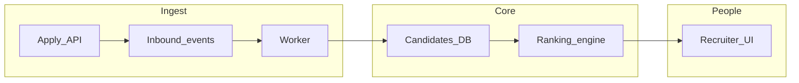
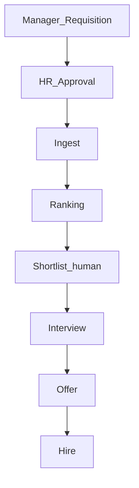

# Enterprise ATS — Technical Presentation (Slide Content)

Presentation-ready slide copy for **RMS** (Next.js ATS). Paste each **Slide** section into one PowerPoint or Google Slides slide. Formulas match shipping defaults; see [ATS_SYSTEM_OVERVIEW.md](./ATS_SYSTEM_OVERVIEW.md), [BUSINESS_SCORE_RANKING.md](./BUSINESS_SCORE_RANKING.md), [AI_EVALUATION_LAYER.md](./AI_EVALUATION_LAYER.md).

**Presenter note:** Weights and engine mode are **environment-configurable**. For engineering audiences, use [Appendix B](#appendix-b-ranking--ai-evaluation-env-defaults-envexample) and your deployment’s actual `.env`.

---

## Slide 1 — Title

**Enterprise ATS: How hiring flows from requisition to ranked candidates**

- One platform for **requisitions**, **candidates**, **pipeline stages**, and **data-driven ranking**
- **Deterministic core** (rules + similarity) plus **optional AI** for richer judgment
- Built for **internal alignment**: executives see outcomes; engineers see architecture; demos show real screens
- **Multi-tenant**: organizations isolated in data and access control

**Optional diagram (textual — for slide or speaker notes)**

---

## Slide 2 — What problem we solve

**From scattered spreadsheets to a single hiring system**

- **Problem:** Requisitions, resumes, and decisions live in email, files, and ad-hoc notes—no shared truth, weak audit trail
- **Traditional ATS gaps:** Keyword-only match misses meaning; pure ML is a black box; stage and interview signal often ignored
- **Our approach:** **Hybrid ranking** = keyword + semantic + business signals, blended with **ATS V1 rules**, then **optional AI** on top—**explainable** fields travel with every score
- **Automation where it helps:** Async ingest and parsing; **human gates** for approvals, shortlist, and offers

---

## Slide 3 — End-to-end lifecycle

**Hiring Manager to hire: who acts, what automates**

- **Hiring Manager / HR:** Open **requisition** and **line items** (roles); budgets and approvals per your workflow
- **HR / TA:** **Candidate ingestion** (apply link, manual add, uploads); **stage** moves (Sourced → Shortlisted → Interviewing → Offered → Hired / Rejected)
- **System:** **Ranking** recomputes or serves a **cached snapshot** when config matches; **AI evaluation** runs on demand or uses **cache** (no surprise LLM spend on every page load)
- **Humans decide:** Shortlist, interview panels, offers; **system recommends** with reasons (matched skills, gaps, summaries)
- **Automation:** Public apply → **inbound_events** → **queue worker** → parse, dedupe, persist (see next slides)

**Optional diagram (textual)**

---

## Slide 4 — Data ingestion

**How candidates enter the system**

- **Public apply:** `POST` to public apply API → **202 Accepted**; body stored as **inbound event** (safe, ordered ledger)
- **Manual / internal:** TA and HR create or update candidates via authenticated APIs; **resume upload** returns a stored path
- **Future / integrations:** Same **inbound_events** pattern for partners (e.g. job boards, LinkedIn-style feeds)
- **Resume:** File stored per environment (**local path or object storage**—implementation follows `resume_path` and upload routes)
- **Reliability:** Raw payload retained; processing is **asynchronous** (worker + queue) so spikes do not block the browser

---

## Slide 5 — Inbound processing (async)

**Queue, parse, dedupe, persist**

- **inbound_events:** Append-only record of what arrived; supports retries and operational debugging
- **Worker chain (conceptual):** normalize → **parse resume** (if URL/path) → **dedupe** (email-first; soft signals for review) → **upsert candidate** and sync application/stage as needed
- **Why async:** Parsing and embedding-scale work are **slow**; API stays fast; failures can be retried without losing the original payload
- **Human touchpoint:** Duplicate or ambiguous matches can be flagged for review depending on policy

---

## Slide 6 — Resume processing pipeline

**Resume → structured profile → database**

- **Extract:** PDF/DOCX → plain text; heuristics for skills, experience years, notice period, education snippet
- **Structured profile (optional):** Rules-based extractor + optional **LLM refinement** produces **versioned JSON** (skills, projects, experience lines) merged with **DB and form data** (DB wins; parser fills gaps)
- **Normalization:** Skills mapped to canonical tokens (e.g. aliases folded) for fair comparison to **required skills**
- **Missing data:** Signals carry **source** (database vs structured vs parser vs none) and **partial-data flags** in explain output—scores do not pretend certainty where fields are empty

**Example (illustrative)**

- Raw line: *"Worked on React, AWS EC2…"*
- Parsed shape: `skills: ["react", "aws ec2"]`, experience and projects filled when text supports them

---

## Slide 7 — Hybrid ranking engine (Phase 5 composite)

**Three pillars before rules layer**

1. **Keyword (~40% default)** — Overlap between **required JD text terms** and candidate text (resume, interviews, profile fields); rewards explicit mentions
2. **Semantic (~25% default)** — **Lexical + embedding similarity** between job narrative and candidate text (embeddings cached per candidate/item)
3. **Business (~35% default)** — **Pipeline stage** baseline, **interview outcomes** (pass/fail/hold adjustments), small bonuses for phone / resume on file / company present

**Formula (Phase 5)**

`phase5 = w_kw × keyword + w_sem × semantic + w_bus × business`

**Defaults:** `w_kw = 0.40`, `w_sem = 0.25`, `w_bus = 0.35` (tunable via env)

---

## Slide 8 — ATS V1 (rule-based layer)

**Structured fit: experience, notice, education, seniority**

- **Experience:** Candidate years vs **required** years (merged signals from DB + structured resume + parser)
- **Notice period:** Mapped to a score band (shorter often better for time-to-start)
- **Education:** Token overlap vs job education requirement
- **Seniority:** Band fit vs job **skill level**
- **Partial data:** Missing dimensions apply **documented penalties** so thin profiles do not score like complete ones
- **Example (illustrative):** Required 3 yrs, candidate shows 2 yrs; notice 30 days → moderate subscores combine to a **moderate** ATS V1 score (exact number depends on full breakdown)

---

## Slide 9 — Final deterministic score (hybrid mode)

**Blending Phase 5 with ATS V1**

- **Default engine mode:** `hybrid` — combines **Phase 5** with **ATS V1**
- **Formula:** `final_det = (1 − w_ats) × phase5 + w_ats × ats_v1`
- **Default:** `w_ats = 0.35` (`RANKING_ATS_V1_WEIGHT`)

**Example**

- Phase 5 = 70, ATS V1 = 50
- `final = 0.65 × 70 + 0.35 × 50 = 45.5 + 17.5 = 63`
- **Skill gate (after blend):** If required skills exist but **match is weak**, `final_score` is **multiplied** by a penalty (e.g. no match vs required list → stronger penalty)—see explain payload for the multiplier

---

## Slide 10 — AI evaluation layer (optional)

**What the model assesses**

- **Dimensions (each 0–100):** project complexity, growth trajectory, company reputation, JD alignment; plus **confidence** (0–1), **summary**, and **risks**
- **AI composite score:** `ai = 0.30×project + 0.25×growth + 0.15×company + 0.30×jd_alignment` (clamped 0–100)
- **When LLM runs:** **POST** ai-evaluation (staff-triggered or automation); **GET with `ai_eval=1`** only **merges cache**—no live LLM call
- **Guardrails:** Payload is **normalized** (no raw resume blobs in the prompt shape); truncation caps protect cost and latency

---

## Slide 11 — Blending AI with the deterministic score

**Display / sort score when cache hits**

- **Blend:** `display = (1 − w_ai) × deterministic_final + w_ai × ai_score`
- **Weight logic:** If model **confidence ≥ 0.5** → `w_ai = 0.30`; else `w_ai = 0.10`; if no cached evaluation for this **input hash** → `w_ai = 0`
- **Example:** Deterministic = 70, AI = 47.5, high confidence → `0.7×70 + 0.3×47.5 = 63.25`
- **UX note:** Pipeline lists often show **deterministic** score; detail views may show **AI-enriched** sort if enabled—label **“rank score with AI”** vs base score for clarity

---

## Slide 12 — Explainability (what users see)

**Trust through transparency**

- **Matched / missing skills** and **required terms** (not just a single number)
- **ATS V1 breakdown** subscores and flags (partial data, mismatch hints)
- **Business/stage** context reflected in the business pillar
- **AI:** Short **summary**, **risk bullets**, **confidence**, and stored **breakdown** dimensions
- **Example bullets:** Strong overlap on core stack; experience in range; gap on a required cloud skill—backed by structured fields, not narrative only

---

## Slide 13 — Data handling, storage, and caching

**Where state lives**

- **PostgreSQL:** Requisitions, items, candidates, applications, interviews, **ranking snapshots**, **per-job candidate scores**, embeddings metadata
- **Resume:** File storage + **parse cache** on candidate; optional **structured profile** JSON; **parse artifacts** for audit
- **AI:** Table `candidate_ai_evaluations` keyed by **organization, item, candidate, input_hash**—same JD + candidate normalization → **reuse**; change JD/model/prompt version → **new hash**, new run if needed
- **Ranking snapshots:** Avoid recomputing on every page load when **weights and version** unchanged
- **Audit:** Stage history, inbound ledger, and stored breakdowns support **post-hoc review**

---

## Slide 14 — Edge cases and resilience

**Production-grade behavior**

- **Duplicates:** Email-first dedupe; optional **resume hash** linkage or strict reject per policy
- **Missing JD/skills:** Ranking may **422** if no required skills unless explicitly allowed by env
- **Parser failure:** Candidate still exists; signals marked partial; keyword/semantic may be thin
- **AI failure:** Deterministic ranking unchanged; per-candidate status `llm_failed` with **reason**; retries/backoff for transient provider errors
- **Fairness:** Skill gate and partial-data penalties prevent “empty resume, high score” failure modes

---

## Slide 15 — Performance, scale, and closing summary

**Designed to grow**

- **Async ingest** and **workers** absorb load spikes
- **Top-N AI** patterns (evaluate leaders first) control cost
- **Caching:** Embeddings, ranking snapshots, AI rows by **hash**
- **Indexing / DB:** Standard relational model with org scoping for tenant isolation

**Closing message**

- **Deterministic backbone** (hybrid + ATS V1 + skill gate) for **auditable, tunable** decisions
- **AI as an optional amplifier** with **confidence-aware** blending and **cache discipline**
- **Explainability** wired into APIs for **CEO, manager, and engineer** audiences from the same facts

---

## Appendix A — Build the deck (checklist)

Use this doc as **source copy**; finishing the slide deck is a quick manual step:

1. Create a 15-slide deck; paste each **Slide N** title + bullets (omit mermaid blocks or paste into speaker notes / a diagram tool).
2. Add **company branding** (template, fonts, colors).
3. Add **2–3 product screenshots**: e.g. TA requisition + ranking list, candidate detail / evaluation, HR pipeline if applicable.
4. Optional: one **deployment architecture** slide (app, PostgreSQL, Redis, workers) for technical stakeholders.

---

## Appendix B — Ranking & AI evaluation env defaults (`.env.example`)

Values below are from [`rms-next/.env.example`](../.env.example) as of this document. **Production may differ.**

| Variable | Example / default in repo | Role |
|----------|---------------------------|------|
| `RANKING_KEYWORD_WEIGHT` | `0.40` | Phase 5 keyword pillar weight |
| `RANKING_SEMANTIC_WEIGHT` | `0.25` | Phase 5 semantic pillar weight |
| `RANKING_BUSINESS_WEIGHT` | `0.35` | Phase 5 business pillar weight |
| `RANKING_ENGINE` | `hybrid` | `hybrid` \| `ats_v1` \| `phase5_only` |
| `RANKING_ATS_V1_WEIGHT` | `0.35` | Blend of Phase 5 vs ATS V1 in hybrid mode |
| `RANKING_ALLOW_EMPTY_REQUIRED_SKILLS` | `false` | If false, ranking may reject when no required skills resolved |

**AI evaluation (optional layer)** — many keys are commented in `.env.example`; defaults are documented in comments and in [AI_EVALUATION_LAYER.md](./AI_EVALUATION_LAYER.md).

| Variable (from `.env.example` comments) | Typical default | Role |
|----------------------------------------|-----------------|------|
| `AI_EVAL_ENABLED` | off (`false`) | Enable POST evaluation runs |
| `AI_EVAL_LLM_PROVIDER` | `gemini` (example) | `openai` or `gemini` |
| `AI_EVAL_MODEL` | `gpt-4o-mini` | OpenAI model id |
| `AI_EVAL_GEMINI_MODEL` | `gemini-2.5-flash` | Gemini model id |
| `AI_EVAL_TIMEOUT_MS` | `45000` | LLM request timeout |
| `AI_EVAL_MAX_INPUT_CHARS` | `16000` | Cap on serialized user JSON |
| `AI_EVAL_PROMPT_VERSION` | `ai-eval-v1` | Bumps cache invalidation when changed |
| `AI_EVAL_MIN_INTERVAL_MS` | `1500` | Spacing between candidate LLM calls |
| `AI_EVAL_429_MAX_RETRIES` | `3` | Rate-limit retries |
| `AI_EVAL_429_FAIL_FAST` | `true` (example) | Skip long backoff when true |
| `AI_EVAL_429_BACKOFF_CAP_MS` | `90000` | Max wait between retries |

**Blend weights in code (not env):** AI vs deterministic uses `w_ai = 0.30` if confidence ≥ 0.5, else `0.10`; see `resolveAiBlendWeight` in `ai-evaluation.schema.ts`.
